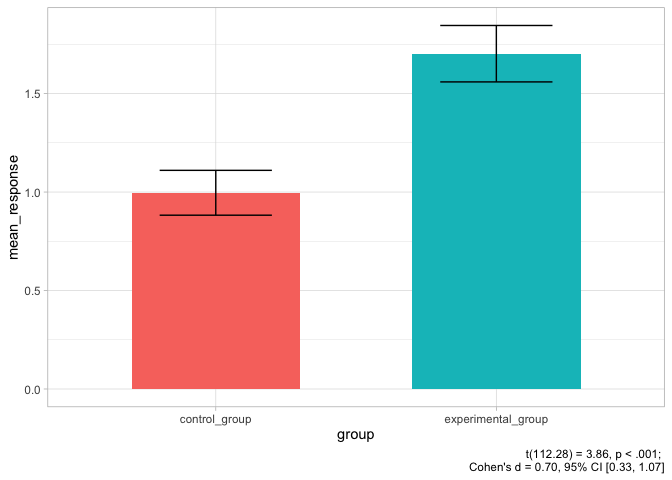

# Hi, I’m Devin

<!-- badges: start -->
<!-- badges: end -->

I’m a Data Scientist with experience working in academic, private, and
non-profit research. I work mostly in R but am comfortable with Python
and enjoy working in SQL. I’m currently pursuing a PhD in Experimental
Psychology, conducting experiments and learning how to leverage existing
data to understand human as well as organizational behavior.

I like writing code

``` r
#Simulation for power analysis
n_sims <- 100

p_vals <- c()

for(i in 1:n_sims){
  control_group <- rnorm(60, 1, 1)
  experimental_group <- rnorm(60, 1.5, 1)
  p_vals[i] <- t.test(control_group, experimental_group)$p.value
}

statistical_power <- mean(p_vals < .05)
statistical_power
#> [1] 0.78
```

and making plots
<!-- -->
