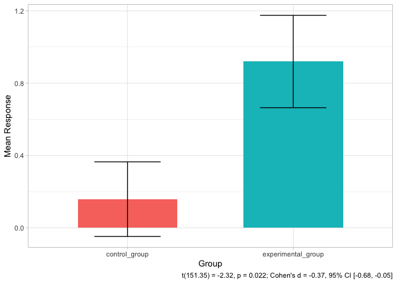

# johnson-dl

<!-- badges: start -->
<!-- badges: end -->

Hi, I’m Devin … I work in Data Science and Research Psychology. I’m
excited about learning and teaching all things programming, statistics.
I work mostly in R but am comfortable with Python and enjoy working in
SQL.

``` r
#Simulation program 
set.seed(123)
n_sims <- 100

p_vals <- c()

for(i in 1:n_sims){
  control_group <- rnorm(15, 1,.5)
  experimental_group <- rnorm(15, 1.5,.5)
  p_vals[i] <- t.test(control_group, experimental_group, var.equal = TRUE, conf.int = .95)$p.value
}

power <- mean(p_vals < .05)
power
#> [1] 0.74
```

<!-- -->
